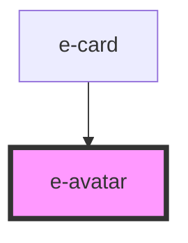

# e-avatar

<!-- Auto Generated Below -->

## Properties

| Property   | Attribute  | Description | Type                                            | Default     |
| ---------- | ---------- | ----------- | ----------------------------------------------- | ----------- |
| `color`    | `color`    |             | `string`                                        | `"#CBD5E0"` |
| `outlined` | `outlined` |             | `boolean`                                       | `undefined` |
| `size`     | `size`     |             | `"lg" \| "md" \| "sm" \| "xl" \| "xs" \| "xxl"` | `"md"`      |
| `text`     | `text`     |             | `string`                                        | `undefined` |

## Dependencies

### Used by

 - [e-card](../e-card)

### Graph

----------------------------------------------

*Built with [StencilJS](https://stenciljs.com/)*
