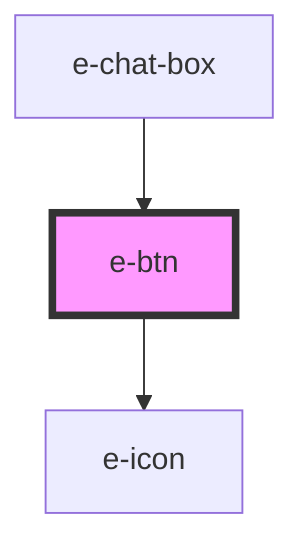

# e-btn

<!-- Auto Generated Below -->

## Properties

| Property      | Attribute      | Description                                                         | Type                                            | Default     |
| ------------- | -------------- | ------------------------------------------------------------------- | ----------------------------------------------- | ----------- |
| `appendIcon`  | `append-icon`  | Append icon                                                         | `string`                                        | `""`        |
| `disabled`    | `disabled`     | Disable button                                                      | `boolean`                                       | `undefined` |
| `icon`        | `icon`         | Turn button into the icon button. Pass icon code to this attribute. | `string`                                        | `undefined` |
| `prependIcon` | `prepend-icon` | Prepend icon                                                        | `string`                                        | `""`        |
| `rounded`     | `rounded`      | Make button edges rounded                                           | `boolean`                                       | `undefined` |
| `size`        | `size`         | Button size                                                         | `"lg" \| "md" \| "sm" \| "xl" \| "xll" \| "xs"` | `"xs"`      |

## Dependencies

### Used by

 - [e-chat-box](../e-chat-box)

### Depends on

- [e-icon](../e-icon)

### Graph

----------------------------------------------

*Built with [StencilJS](https://stenciljs.com/)*
