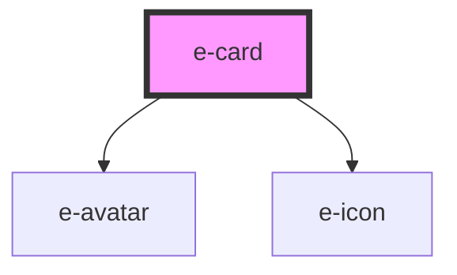

# e-card

<!-- Auto Generated Below -->

## Properties

| Property       | Attribute       | Description | Type                             | Default     |
| -------------- | --------------- | ----------- | -------------------------------- | ----------- |
| `backdrop`     | `backdrop`      |             | `boolean`                        | `true`      |
| `backdropBlur` | `backdrop-blur` |             | `"medium" \| "strong" \| "weak"` | `"weak"`    |
| `dark`         | `dark`          |             | `boolean`                        | `undefined` |

## Dependencies

### Depends on

- [e-avatar](../e-avatar)
- [e-icon](../e-icon)

### Graph

----------------------------------------------

*Built with [StencilJS](https://stenciljs.com/)*
