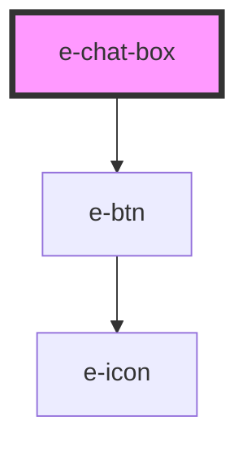

# e-chat-box

<!-- Auto Generated Below -->

## Properties

| Property           | Attribute            | Description | Type                             | Default               |
| ------------------ | -------------------- | ----------- | -------------------------------- | --------------------- |
| `appendIcon`       | `append-icon`        |             | `string`                         | `"ph-dots-three"`     |
| `backdrop`         | `backdrop`           |             | `boolean`                        | `true`                |
| `backdropBlur`     | `backdrop-blur`      |             | `"medium" \| "strong" \| "weak"` | `"weak"`              |
| `dark`             | `dark`               |             | `boolean`                        | `true`                |
| `outerAppendIcon`  | `outer-append-icon`  |             | `string`                         | `"ph-paper-plane"`    |
| `outerPrependIcon` | `outer-prepend-icon` |             | `string`                         | `"ph-plus"`           |
| `placeholder`      | `placeholder`        |             | `string`                         | `"Message to..."`     |
| `prependIcon`      | `prepend-icon`       |             | `string`                         | `"ph-smiley-sticker"` |
| `type`             | `type`               |             | `string`                         | `'text'`              |
| `value`            | `value`              |             | `string`                         | `undefined`           |

## Events

| Event               | Description | Type                  |
| ------------------- | ----------- | --------------------- |
| `appendClick`       |             | `CustomEvent<string>` |
| `outerAppendClick`  |             | `CustomEvent<string>` |
| `outerPrependClick` |             | `CustomEvent<string>` |
| `prependClick`      |             | `CustomEvent<string>` |
| `valueChange`       |             | `CustomEvent<any>`    |

## Dependencies

### Depends on

- [e-btn](../e-btn)

### Graph

----------------------------------------------

*Built with [StencilJS](https://stenciljs.com/)*
