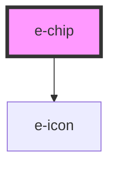

# e-chip

<!-- Auto Generated Below -->

## Properties

| Property      | Attribute      | Description | Type      | Default     |
| ------------- | -------------- | ----------- | --------- | ----------- |
| `color`       | `color`        |             | `string`  | `undefined` |
| `disabled`    | `disabled`     |             | `boolean` | `undefined` |
| `outlined`    | `outlined`     |             | `boolean` | `undefined` |
| `prependIcon` | `prepend-icon` |             | `string`  | `undefined` |
| `rounded`     | `rounded`      |             | `boolean` | `undefined` |
| `shadow`      | `shadow`       |             | `boolean` | `undefined` |
| `text`        | `text`         |             | `boolean` | `undefined` |
| `textColor`   | `text-color`   |             | `string`  | `undefined` |

## Dependencies

### Depends on

- [e-icon](../e-icon)

### Graph

----------------------------------------------

*Built with [StencilJS](https://stenciljs.com/)*
