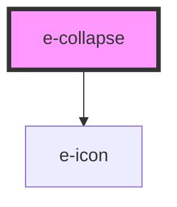

# e-collapse

<!-- Auto Generated Below -->

## Properties

| Property      | Attribute      | Description | Type     | Default            |
| ------------- | -------------- | ----------- | -------- | ------------------ |
| `closeIcon`   | `close-icon`   |             | `string` | `"ph-x-circle"`    |
| `headerTitle` | `header-title` |             | `string` | `undefined`        |
| `openIcon`    | `open-icon`    |             | `string` | `"ph-plus-circle"` |

## Dependencies

### Depends on

- [e-icon](../e-icon)

### Graph

----------------------------------------------

*Built with [StencilJS](https://stenciljs.com/)*
