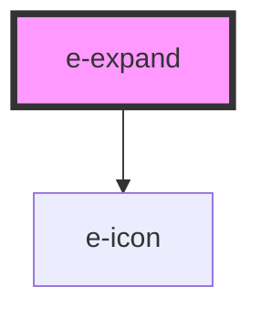

# e-expand

<!-- Auto Generated Below -->

## Properties

| Property         | Attribute          | Description | Type     | Default       |
| ---------------- | ------------------ | ----------- | -------- | ------------- |
| `elevation`      | `elevation`        |             | `string` | `"6"`         |
| `hideButtonText` | `hide-button-text` |             | `string` | `"Show less"` |
| `maxHeight`      | `max-height`       |             | `string` | `"100px"`     |
| `openButtonText` | `open-button-text` |             | `string` | `"Show more"` |

## Dependencies

### Depends on

- [e-icon](../e-icon)

### Graph

----------------------------------------------

*Built with [StencilJS](https://stenciljs.com/)*
