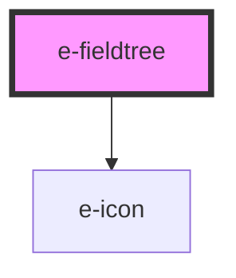

# e-fieldtree

<!-- Auto Generated Below -->

## Properties

| Property | Attribute | Description | Type     | Default                                                                                                                                                                                                                                                                                                                                                                                                                                                                                                                                                                                                                                                             |
| -------- | --------- | ----------- | -------- | ------------------------------------------------------------------------------------------------------------------------------------------------------------------------------------------------------------------------------------------------------------------------------------------------------------------------------------------------------------------------------------------------------------------------------------------------------------------------------------------------------------------------------------------------------------------------------------------------------------------------------------------------------------------- |
| `fields` | `fields`  |             | `string` | `"[{\"id\":1,\"icon\":\"ph-folder\",\"name\":\"Cats\",\"children\":[{\"id\":2,\"icon\":\"ph-file\",\"name\":\"Color cats\",\"children\":[{\"id\":3,\"name\":\"Yellow cats\"},{\"id\":4,\"name\":\"Black cats\"}]}]},{\"id\":5,\"icon\":\"ph-folder\",\"name\":\"Dogs\",\"children\":[{\"id\":6,\"icon\":\"ph-file\",\"name\":\"Color dogs\",\"children\":[{\"id\":7,\"name\":\"Yellow dogs\"},{\"id\":8,\"name\":\"Black dogs\"}]}]},{\"id\":9,\"icon\":\"ph-folder\",\"name\":\"Fishes\",\"children\":[{\"id\":10,\"icon\":\"ph-file\",\"name\":\"Color Fishes\",\"children\":[{\"id\":11,\"name\":\"Yellow Fishes\"},{\"id\":12,\"name\":\"Black Fishes\"}]}]}]"` |

## Dependencies

### Depends on

- [e-icon](../e-icon)

### Graph

----------------------------------------------

*Built with [StencilJS](https://stenciljs.com/)*
