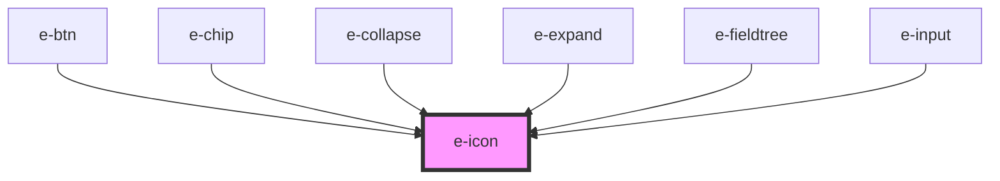

# e-icon

<!-- Auto Generated Below -->

## Properties

| Property | Attribute | Description                      | Type     | Default     |
| -------- | --------- | -------------------------------- | -------- | ----------- |
| `color`  | `color`   | Color of the icon                | `string` | `undefined` |
| `icon`   | `icon`    | Icon from Phosphor Icons library | `string` | `undefined` |
| `size`   | `size`    | Size of the icon                 | `string` | `"inherit"` |

## Dependencies

### Used by

 - [e-btn](../e-btn)
 - [e-chip](../e-chip)
 - [e-collapse](../e-collapse)
 - [e-expand](../e-expand)
 - [e-fieldtree](../e-fieldtree)
 - [e-input](../e-input)

### Graph

----------------------------------------------

*Built with [StencilJS](https://stenciljs.com/)*
