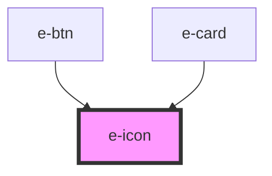

# e-icon

<!-- Auto Generated Below -->

## Properties

| Property | Attribute | Description                      | Type     | Default       |
| -------- | --------- | -------------------------------- | -------- | ------------- |
| `color`  | `color`   | Color of the icon                | `string` | `undefined`   |
| `icon`   | `icon`    | Icon from Phosphor Icons library | `string` | `"ph-smiley"` |
| `size`   | `size`    | Size of the icon                 | `string` | `"inherit"`   |

## Dependencies

### Used by

 - [e-btn](../e-btn)
 - [e-card](../e-card)

### Graph

----------------------------------------------

*Built with [StencilJS](https://stenciljs.com/)*
