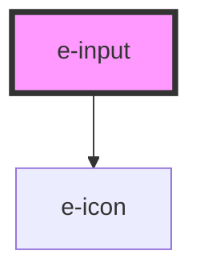

# e-input

<!-- Auto Generated Below -->

## Properties

| Property      | Attribute      | Description | Type                                            | Default     |
| ------------- | -------------- | ----------- | ----------------------------------------------- | ----------- |
| `appendIcon`  | `append-icon`  |             | `string`                                        | `undefined` |
| `ghost`       | `ghost`        |             | `boolean`                                       | `undefined` |
| `outlined`    | `outlined`     |             | `boolean`                                       | `undefined` |
| `placeholder` | `placeholder`  |             | `string`                                        | `undefined` |
| `prependIcon` | `prepend-icon` |             | `string`                                        | `undefined` |
| `rounded`     | `rounded`      |             | `boolean`                                       | `undefined` |
| `size`        | `size`         |             | `"lg" \| "md" \| "sm" \| "xl" \| "xs" \| "xxl"` | `"md"`      |
| `type`        | `type`         |             | `string`                                        | `"text"`    |
| `value`       | `value`        |             | `number \| string`                              | `undefined` |

## Events

| Event          | Description | Type                            |
| -------------- | ----------- | ------------------------------- |
| `valueChanged` |             | `CustomEvent<number \| string>` |

## Dependencies

### Depends on

- [e-icon](../e-icon)

### Graph

----------------------------------------------

*Built with [StencilJS](https://stenciljs.com/)*
